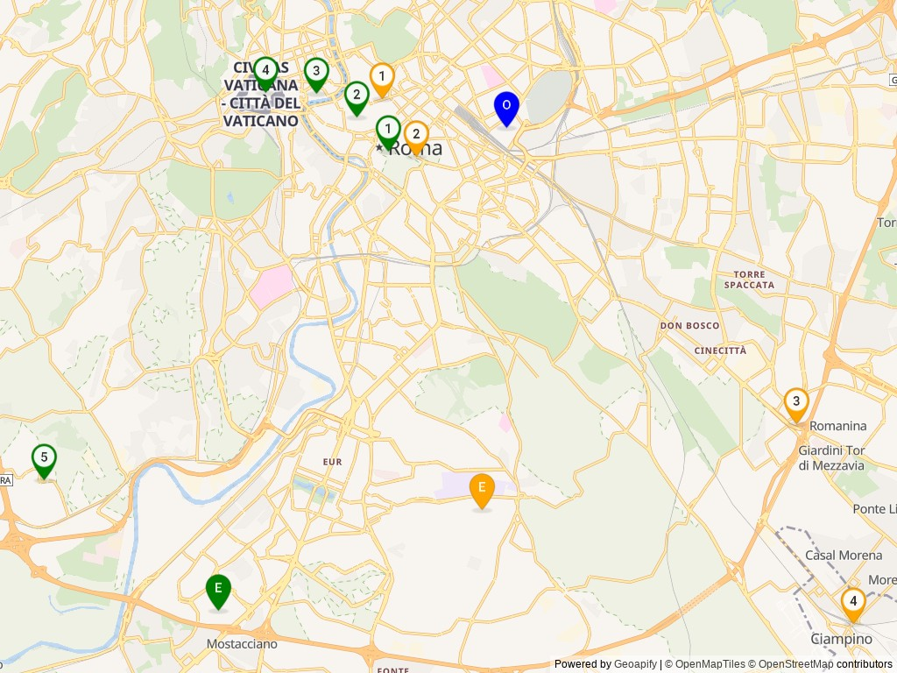

## Example 1

This example sends a request to Geoapify route planner API, read the resulting
route plan, list the job-to-agent mapping, and then map the route plan using
Geoapify's static map API. The resulting URL can then be fetched to retrieve the
static map.

Input data is set up in data.go. The request is to get a route plan for nine
locations that need to be visited by motorcycle. There are two agents / staffs
who are available to visit these locations.

Both must be at the office location as the starting point of the trip and can
end the trip at their home locations.

This example will print the output to the terminal for the purpose of
illustrating the use case.

```
Agent:  004
job Trevi
job Colosseo
job Anagnina
job Ciampino
6.7 hours
39.6 km

Agent:  007
job Foro Romano
job Pantheon
job San Angelo
job San Pietro
job Muratella
6.2 hours
42.1 km

https://maps.geoapify.com/v1/staticmap?style=osm-bright&marker=lonlat:12.515119,41.896917;text:O;whitecircle:no|lonlat:12.483584,41.902458;color:orange;text:1|lonlat:12.492318,41.891484;color:orange;text:2|lonlat:12.588964,41.840847;color:orange;text:3|lonlat:12.603442,41.803033;color:orange;text:4|lonlat:12.508980,41.824617;color:orange;text:E;whitecircle:no|lonlat:12.485082,41.892508;color:green;text:1|lonlat:12.477071,41.899009;color:green;text:2|lonlat:12.466966,41.903521;color:green;text:3|lonlat:12.453992,41.903640;color:green;text:4|lonlat:12.397600,41.830367;color:green;text:5|lonlat:12.442005,41.805514;color:green;text:E;whitecircle:no&apiKey=GEOAPIFY_KEY
```

_This URL is only an illustration; you need to have GEOAPIFY_KEY environment 
variable set up with your api key._

Typically we would fetch the static map either in our backend server and
display it in our app. The static map would look something like this.


